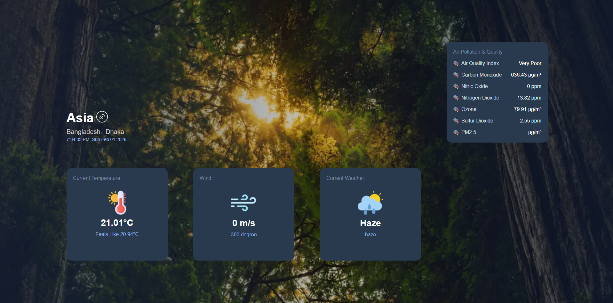

# Eco-Vista: Real-time Environmental Insights



Eco-Vista is a modern web application built with Next.js that provides real-time environmental data including Air Quality Index (AQI), temperature, weather conditions, and wind information for specific locations. Designed with a focus on intuitive user experience and clean aesthetics, Eco-Vista helps users stay informed about their local environment at a glance.

## ✨ Features

- **Location-Based Data:** Retrieve detailed environmental information for any specified location.
- **Comprehensive Metrics:** View Air Quality Index, current temperature, detailed weather forecasts, and wind speed/direction.
- **Parallel Routing:** Efficiently display multiple data streams simultaneously using Next.js parallel routes.
- **Responsive Design:** Optimized for seamless viewing across various devices and screen sizes.
- **Intuitive UI:** Clean and modern interface powered by Tailwind CSS.
- **Graceful Error Handling:** Provides clear feedback when location data is unavailable or cannot be resolved.

## 🚀 Technologies Used

- **Next.js 14+:** React framework for production.
- **React:** Frontend library for building user interfaces.
- **Tailwind CSS:** A utility-first CSS framework for rapid UI development.
- **JavaScript:** Core programming language.
- **Environment Variables:** Secure handling of API keys and sensitive information.

## 📦 Getting Started

Follow these instructions to set up the project locally.

### Prerequisites

- Node.js (v18 or higher)
- npm or Yarn

### Installation

1.  **Clone the repository:**

    ```bash
    https://github.com/Mahmudulislamshuvo/eco-vista-project
    cd eco-vista
    ```

2.  **Install dependencies:**

    ```bash
    npm install
    # or
    yarn install
    ```

3.  **Set up Environment Variables:**
    Create a `.env` file in the root of the project based on `.env.example` (if one exists). You will need API keys for the weather and geocoding services used by the application.
    ```
    # Example .env content
    B_DATA_API_KEY=your_geo_api_key_here
    OPENWEATHER_API_KEY=your_openweather_api_key_here
    ```

### Running Locally

```bash
npm run dev
# or
yarn dev
```

Open [http://localhost:3000](http://localhost:3000) with your browser to see the result.

## 🌐 Live Demo

[Link to Live Demo (e.g., Vercel, Netlify)](https://your-live-demo-url-here.com)

## 🎥 Video Walkthrough

Here's a brief video showcasing the application's features and functionality:

https://github.com/user-attachments/assets/4e744687-7c34-48d4-9d97-5288ab94ca56

## 💡 Usage

Navigate to a specific location by typing its name in the search bar or by using the URL pattern: `http://localhost:3000/your-city-name`.

Example: `http://localhost:3000/london` or `http://localhost:3000/paris`

## Contributing

Contributions are welcome! If you have suggestions for improvements, please open an issue or submit a pull request.

## License

This project is licensed under the MIT License. See the [LICENSE](LICENSE) file for details.
